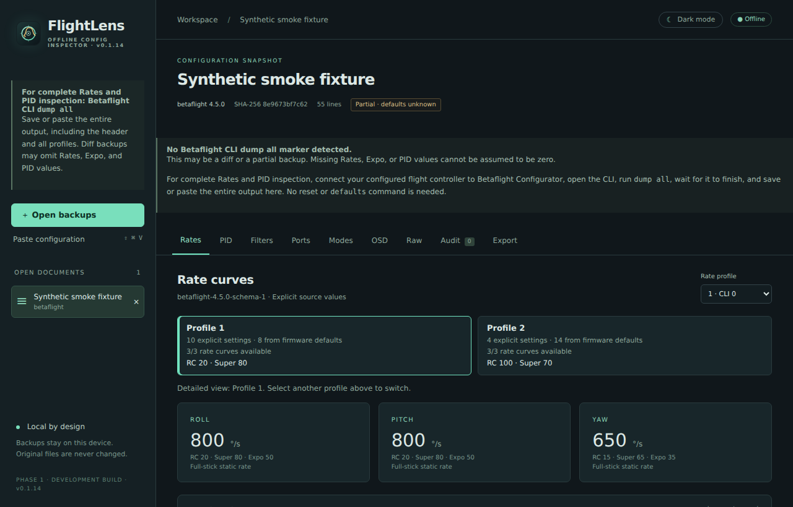
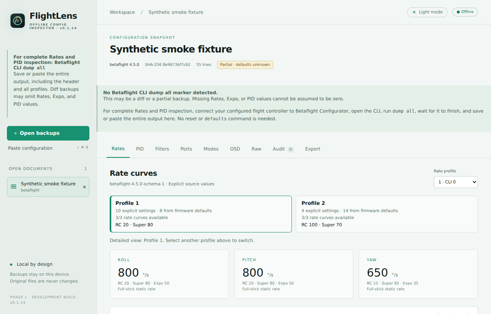
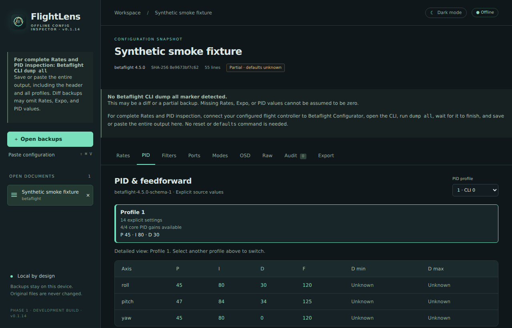
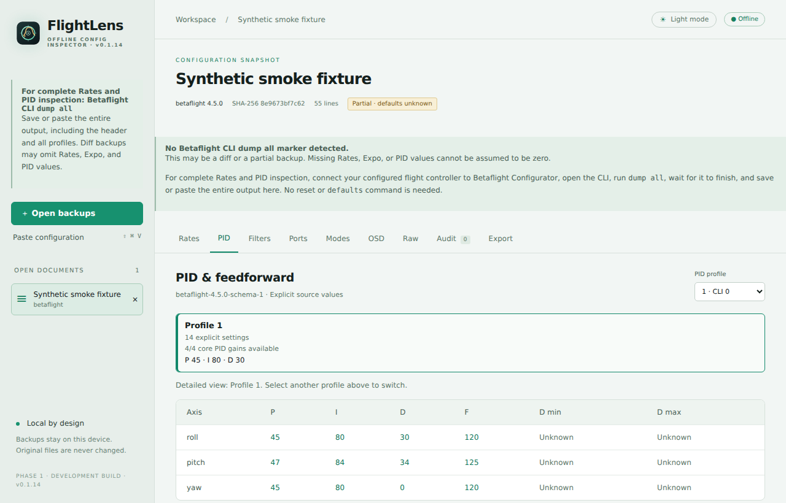
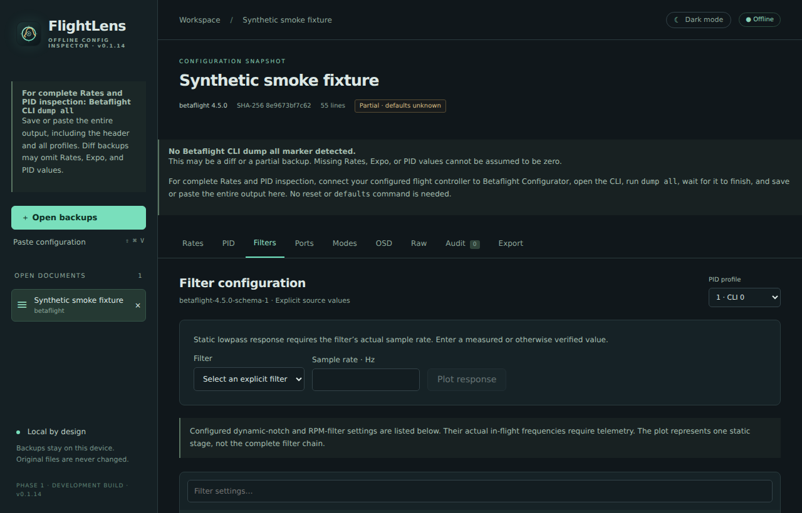
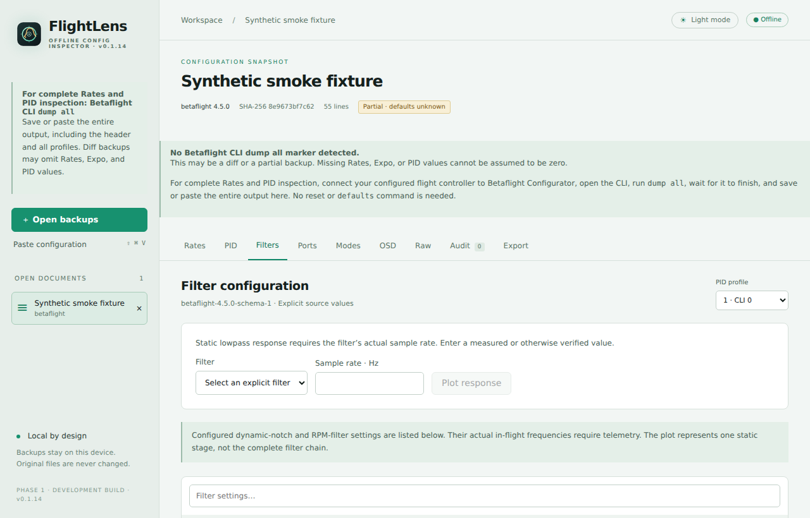
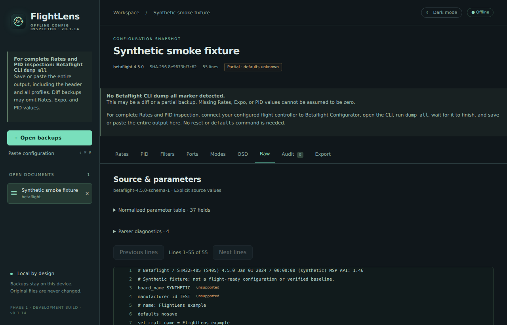
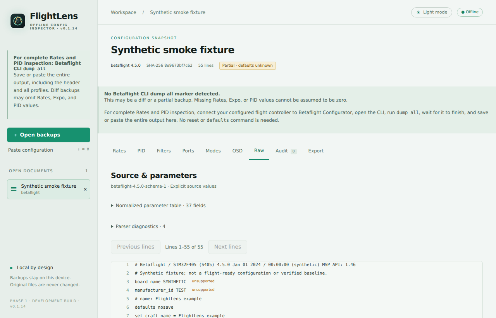
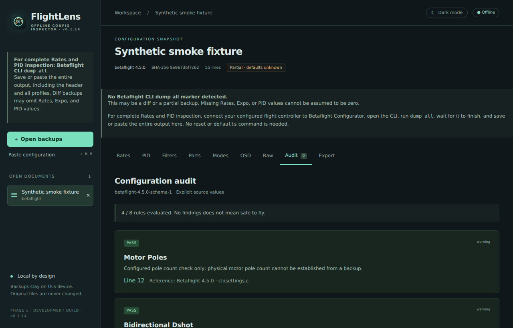
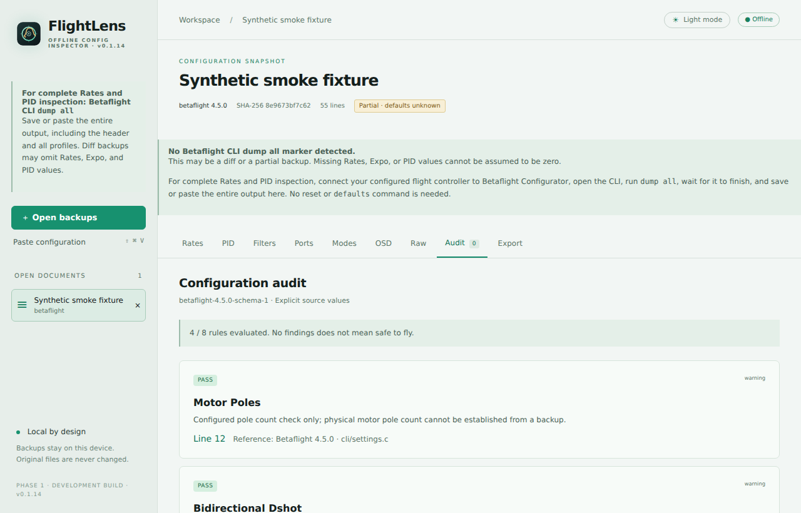

<p align="center">
  
</p>

<h1 align="center">FlightLens</h1>

<p align="center"><strong>See what your flight controller backup is really saying.</strong></p>

<p align="center">
  An offline viewer for Betaflight configuration backups: inspect settings, understand rates and filters, trace values back to source lines, and export small validated snippets without changing the original file.
</p>

<p align="center">
  
  
  
</p>

> **Betaflight compatibility:** FlightLens currently supports configuration backups from Betaflight **4.2, 4.3, 4.4, and 4.5** through bundled, versioned schemas. Vendor builds that append a suffix to a supported release (for example, `4.5.3.KAACK_V19`) use the matching major/minor schema. Other firmware versions may open as partial documents with unsupported values shown as unknown until a compatible schema is available.

> **Required for complete inspection — use `dump all`:** In Betaflight Configurator, connect the configured flight controller, open the **CLI** tab, type `dump all`, press Enter, wait for the command to finish, and save or paste the **entire** output, including the firmware header and every profile. A `diff` or `diff all` backup is allowed, but it omits unchanged Rates, Expo, and PID values; those values will remain **Unknown**. Unknown does not mean zero. Do **not** run `defaults` or reset the controller just to use FlightLens. A complete dump still cannot make an unsupported firmware version compatible, and vendor builds may differ from certified defaults.

## Screenshots

The images below come from the built-in synthetic example (**Explore a synthetic example** on the start screen), not from a real aircraft backup. Use the **Dark mode / Light mode** button in the top bar to switch themes; the choice is remembered on the next launch.

| Dark | Light |
| --- | --- |
| [](docs/screenshots/rates-dark.png) | [](docs/screenshots/rates-light.png) |
| **Rates** — curves, per-axis summary, and profile selection. | The same view in light mode. |
| [](docs/screenshots/pid-dark.png) | [](docs/screenshots/pid-light.png) |
| **PID** — gains and feedforward, with unknown values kept unknown. | The same view in light mode. |
| [](docs/screenshots/filters-dark.png) | [](docs/screenshots/filters-light.png) |
| **Filters** — configured filter settings; a static response plot needs a verified sample rate. | The same view in light mode. |
| [](docs/screenshots/raw-dark.png) | [](docs/screenshots/raw-light.png) |
| **Raw** — the original CLI lines behind every value, with parser diagnostics. | The same view in light mode. |
| [](docs/screenshots/audit-dark.png) | [](docs/screenshots/audit-light.png) |
| **Audit** — findings plus the rules that could not run. | The same view in light mode. |

## Why FlightLens

Flight controller backups are useful, but they are hard to read as raw CLI text. FlightLens turns a backup into a clear, navigable snapshot while keeping the source close at hand.

- **Private by default:** analysis runs locally. There is no account, upload, telemetry, or background network connection.
- **Read-only:** imported files are never edited. FlightLens works from an immutable snapshot and content hash.
- **Honest about uncertainty:** missing values stay unknown; the app does not invent target defaults or pretend a backup proves how an aircraft flies.
- **Traceable:** values, audit findings, and exports link back to the original source lines.
- **Useful at the bench:** compare rates, PID settings, filters, ports, modes, OSD, raw CLI, and audit findings in one place.

## Get started

### 1. Install FlightLens

Download the latest desktop installer from the [FlightLens GitHub Releases](https://github.com/irom77/FlightLens/releases) page.

- **Windows:** download the `.exe` installer, run it, and keep the default per-user installation choice. No administrator account is required.
- **macOS:** download the `.dmg`, open it, and drag FlightLens to **Applications**. On the first launch, macOS may ask you to confirm the app because releases are not code-signed yet; use **Control-click → Open**.

The Windows installer can install Microsoft Edge WebView2 when it is missing. The macOS release is currently distributed as an unsigned `.dmg`.

### 2. Open a backup

Launch FlightLens and open a `.txt`, `.diff`, `.dump`, `.param`, `.parm`, `.bbl`, or `.bfl` file. You can also drop a file on the window or press **Ctrl/Cmd+Shift+V** to paste CLI text.

**Before opening it, use Betaflight CLI `dump all` and save or paste the complete output.** A `diff` or `diff all` file can be opened, but unchanged Rates, Expo, and PID values may be unavailable. FlightLens warns when the imported text does not contain evidence of `dump all`; that warning is intentional. The app preserves missing values as unknown instead of filling them with guesses.

Your original backup is read-only. FlightLens creates an immutable snapshot for inspection and never writes back to the source file.

### Build from source

Developers can run the application locally with Node.js 24, pnpm 10.30.3, Rust, and the platform libraries listed in the [Tauri prerequisites](https://v2.tauri.app/start/prerequisites/).

```sh
pnpm install --frozen-lockfile
pnpm tauri dev
```

To preview the interface in a browser only:

```sh
pnpm dev
```

The browser preview does not have native file access or the Rust analysis commands.

### Run the checks

From WSL/Linux, run the complete automated check suite with:

```sh
./test.sh
```

This verifies Rust and frontend code, generated bindings, and every `.txt` backup
in `/home/irom/fpv_cli_dumps/backups`. To use a different read-only backup folder,
set `FLIGHTLENS_CORPUS`:

```sh
FLIGHTLENS_CORPUS=/path/to/backups ./test.sh
```

The optional strict mode also fails when a compatible backup has no complete Rates
profile or PID profile with known values:

```sh
FLIGHTLENS_CORPUS_STRICT=1 ./test.sh
```

### Windows installer

Windows users should download the latest **FlightLens Windows installer** from the project's [GitHub Releases](https://github.com/irom77/FlightLens/releases) page. Run the `.exe` setup file and keep the default per-user installation choice; no administrator account is required. The installer uses Microsoft Edge WebView2, which is already present on most supported Windows systems and can be installed by the setup process when needed.

The `.msi` package is available for managed or enterprise deployment. Releases are currently unsigned, so Windows SmartScreen may show an additional confirmation until a code-signing certificate is configured.

## What you can do today

### Inspect a backup

Open a Betaflight CLI backup and switch between Rates, PID, Filters, Ports, Modes, OSD, Raw, and Audit. Select independent PID and rate profiles, and click source-linked values to jump to the original line. The interface has dark and light modes; the first launch follows the operating system setting, and the top-bar switch overrides it from then on.

### Understand rates and filters

View Actual, Betaflight, KISS, and QuickRates curves generated by the Rust core. Inspect static lowpass response when a verified sample rate is available. Configured envelopes are shown as configuration facts, not as claims about in-flight behavior.

### Export carefully

Choose Rates, PID/Filters, Modes, OSD, Serial, or a complete explicit VTX table. FlightLens resolves dependencies, blocks unknown required values, reparses the generated snippet, and shows a preview before you copy or save it. Your original backup remains untouched.

### Review audit coverage

Audits identify concrete conflicts and configuration facts, while showing when a rule could not run because the backup lacks enough information. “No findings” never means “safe to fly.”

## Current support

Bundled compatibility schemas cover Betaflight **4.2.0, 4.3.0, 4.4.0, and 4.5.0**. Patch releases use the matching major/minor schema only when their release is in the verified compatibility range; vendor suffixes do not certify that the vendor retained the same defaults. Rate defaults may be recovered for verified releases when the backup declares a reset, but PID defaults and target-specific baselines are not bundled. Therefore omitted PID gains remain unknown, even for a supported firmware version. iNAV and recognizable ArduPilot parameter files are identified for future adapters. Blackbox files are recognized without treating binary data as CLI text; telemetry decoding is planned for a later phase.

FlightLens is an inspection and export assistant. It does not connect to a flight controller, flash firmware, apply tuning recommendations, replace a destination configuration, or certify a craft as flight-ready.

## Project documentation

- [Developer documentation](DEVELOPMENT.md) — architecture, implementation boundaries, checks, fixtures, and contributor workflows.
- [Third-party notices](THIRD_PARTY_NOTICES.md)
- [GPL-3.0-or-later license](LICENSE)

## Roadmap

See the [FlightLens roadmap](ROADMAP.md) for the planned releases and implementation details. Phase 1 is the Betaflight inspection MVP; workspace indexing and comparison follow in Phase 2. Blackbox telemetry and diagnostics are planned for Phase 3, followed by iNAV and ArduPilot adapters in Phase 4.

<p align="center"><sub>FlightLens keeps your backup local, legible, and honest.</sub></p>
